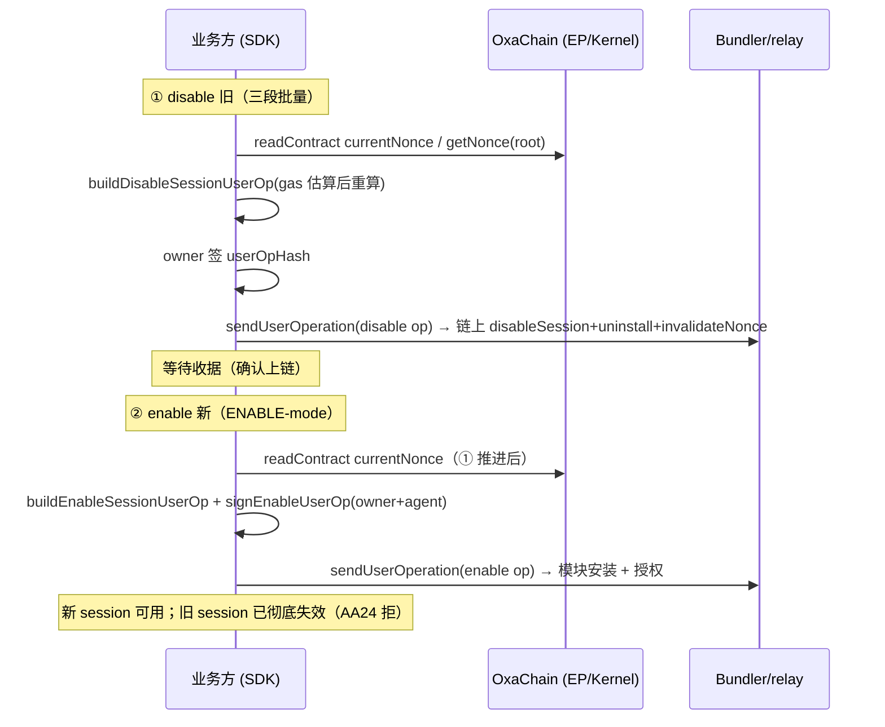

# @0xinfrax/aa-sdk 快速接入指南（Quickstart）

> 适用：**外部集成方（PocketX 等）经 npm SDK 直用构建 ERC-4337 UserOp**。如需走 HTTP 服务接口（agentx/aitrader 等），见 `docs/SERVICE_API_REFERENCE.md` §7.7。
> 版本：`@0xinfrax/aa-sdk@0.1.2`（2026-08-20）。详细技术方案见 `docs/AA_SDK_TECH_DESIGN.md`。

---

## 1. 概览

| 项目 | 说明 |
|---|---|
| 包 | `@0xinfrax/aa-sdk`（npm，`--access public`，`type: module`） |
| 账户 | Kernel v3（ERC-7579 模块化），EntryPoint v0.7 |
| 链 | OxaChain（chainId 19505，原生代币 OXA）为主网目标；测试链 base-sepolia |
| 依赖 | peerDependencies：`viem>=2.0.0`、`permissionless>=0.2.0`（需一并安装） |
| 上链 | 直连 bundler，或经 InfraX aa-relay 公网入口 `https://rpc-gw.0xainet.top/aa-relay/`（鉴权 `X-API-Key`/Bearer） |
| 签名器 | `PrivateKeySigner`（自托管 EOA）/ `ExternalWalletSigner`（用户钱包）/ `MpcSigner`（InfraX MPC）/ `SessionKeySigner` |

---

## 2. 安装

```bash
npm install @0xinfrax/aa-sdk
npm install viem@^2 permissionless@^0.2   # peerDependencies，必须一并安装
```

验证版本与导出：

```bash
node -e "import('@0xinfrax/aa-sdk').then(m => console.log(typeof m.buildDisableSessionUserOp, typeof m.buildEnableSessionUserOp))"
# 预期输出：function function（0.1.2+ 均含）
```

---

## 3. 环境变量（env 配置，零硬编码）

SDK 链配置全部从环境变量加载（`getChainConfig(chain, process.env)`），缺省值内置。

### 3.1 通用

| 变量 | 必填 | 说明 |
|---|---|---|
| `AA_ENABLED_CHAINS` | 选 | 启用链别名逗号列表（如 `oxachain`）；缺省 `base-sepolia` |

### 3.2 按链覆盖（OxaChain 生产值，2026-08-19 核对）

| 变量 | 说明 |
|---|---|
| `AA_OXACHAIN_RPC_URL` | 链 RPC（只读调用）：`https://rpc-oxa.0xainet.top` |
| `AA_OXACHAIN_ENTRYPOINT_V07` | EntryPoint v0.7：`0x97e4cddcffeaf4580bc6315fee512f2b2d82798a` |
| `AA_OXACHAIN_IMPLEMENTATION` | Kernel v3 implementation：`0x5131d75af2126eba05edbb6bc24902c42d1b52b4` |
| `AA_OXACHAIN_FACTORY` | KernelFactory：`0xf8abe4510a6810d5ef26aa3222c0f63d32b757d1` |
| `AA_OXACHAIN_ECDSA_VALIDATOR` | ECDSA root validator：`0xb0d4f548e022b8a9d5b454ffb7f327ee2afeb16c` |
| `AA_OXACHAIN_SESSION_MODULE` | Session validator 模块：`0xfbbca78d2d7d08c1163aa57a0056973ef4fd8c74` |
| `AA_OXACHAIN_BUNDLERS` | Bundler 端点（主+备 JSON 数组，或纯 URL）：`http://43.156.78.59:4338`（自建 Alto） |
| `AA_OXACHAIN_PAYMASTER_URL` | Paymaster（可选）：经 aa-relay 代理隐藏 apikey，见 §3.3 |

> 链别名 → chainId：`oxachain:19505`、`base-sepolia:84532`、`base:8453`、`arbitrum:42161`、`optimism:10`、`polygon:137`、`ethereum:1`、`bsc:56`。

### 3.3 经 aa-relay 公网入口（推荐：apikey 不出客户端）

```bash
# 中继 / 计费：仅需服务端持有 key；客户端零密钥
AA_RELAY_URL=https://rpc-gw.0xainet.top/aa-relay
AA_RELAY_API_KEY=<向 InfraX 申请>

# Paymaster 走 relay 代理（服务端注入 X-API-Key）
AA_OXACHAIN_PAYMASTER_URL={"url":"https://rpc-gw.0xainet.top/aa-relay/v1/paymaster","headers":{"X-API-Key":"<key>"}}
```

### 3.4 `.env.example` 最小集

```bash
AA_ENABLED_CHAINS=oxachain
AA_OXACHAIN_RPC_URL=https://rpc-oxa.0xainet.top
AA_OXACHAIN_BUNDLERS=http://43.156.78.59:4338
AA_OXACHAIN_ENTRYPOINT_V07=0x97e4cddcffeaf4580bc6315fee512f2b2d82798a
AA_OXACHAIN_IMPLEMENTATION=0x5131d75af2126eba05edbb6bc24902c42d1b52b4
AA_OXACHAIN_FACTORY=0xf8abe4510a6810d5ef26aa3222c0f63d32b757d1
AA_OXACHAIN_ECDSA_VALIDATOR=0xb0d4f548e022b8a9d5b454ffb7f327ee2afeb16c
AA_OXACHAIN_SESSION_MODULE=0xfbbca78d2d7d08c1163aa57a0056973ef4fd8c74
# 以下仅在需要 sponsor 代付时配置
# AA_OXACHAIN_PAYMASTER_URL={"url":"https://rpc-gw.0xainet.top/aa-relay/v1/paymaster","headers":{"X-API-Key":"<key>"}}
```

---

## 4. 基础用法

### 4.1 初始化链配置 + 创建账户

```ts
import { getChainConfig, createAAClient, createKernelAccount, PrivateKeySigner } from '@0xinfrax/aa-sdk';

const cfg = getChainConfig('oxachain', process.env); // AA_OXACHAIN_* env

// 只读 client（读 nonce / currentNonce / 估算；链配置自动加载）
const client = createAAClient(cfg);

// owner 签名器（示例：自托管 EOA；外部钱包用 ExternalWalletSigner，MPC 用 MpcSigner）
const ownerSigner = new PrivateKeySigner(process.env.OWNER_PRIVATE_KEY!);
const account = await createKernelAccount({ owner: ownerSigner, chainConfig: cfg });
console.log('smart account:', account.address);
```

### 4.2 一次性交易 UserOp（非 session）

```ts
import { buildUserOp, signUserOp, BundlerClient, entryPointAbi } from '@0xinfrax/aa-sdk';

const op = buildUserOp({
  sender: account.address,
  nonce: await client.readContract({ address: cfg.entryPoint, abi: entryPointAbi, functionName: 'getNonce', args: [account.address, 0n] }),
  call: { target: '0x...', value: 0n, data: '0x...' },
});
const signed = await signUserOp(op, cfg.entryPoint, cfg.chainId, ownerSigner);

// 上链：直连 bundler 或经 relay
const tx = await new BundlerClient(cfg).sendUserOperation(signed, account.address);
```

---

## 5. 完整会话轮换流程（两笔 UserOp）

> ⚠️ **Kernel v3.0-beta 链上实证：轮换 = 两笔 UserOp，勿改单笔。**
> 单笔 `[uninstall + invalidate + install]` 不可行：root-mode `installModule` 不设置 `allowedSelectors` → `validateUserOp` revert `InvalidValidator` → EntryPoint 报 **AA24**。
>
> ① disable 旧（root-mode，owner 签 `userOpHash`）→ **确认上链后** ② enable 新（ENABLE-mode，owner 签 digest + agent 签 op）。

### 5.1 前置：创建新 session 策略

```ts
import { randomBytes, toHex } from 'viem';
import { assertValidPolicy, type SessionPolicy } from '@0xinfrax/aa-sdk';

const newPolicy: SessionPolicy = {
  network: cfg.network, // 'evm'
  sessionId: toHex(randomBytes(32)),
  signer: agentSigner.address,           // 新 session key 公钥地址
  validAfter: 0n,
  validUntil: BigInt(Math.floor(Date.now()/1000) + 30*24*3600), // 30 天
  permissions: [{
    targets: ['0x...'],                  // 目标合约白名单（空 = 全部禁止）
    selectors: ['0x...'],                // 允许的 selector（空 = 全部允许）
    valueLimit: 100000000000000000n,     // 单笔限额（wei，0 = 不限）
    dailyLimit: 0n,
  }],
};
assertValidPolicy(newPolicy); // 校验失败即抛错
```

### 5.2 ① disable 旧 session（三段批量）

构建 draft → owner 签名 → 上链：

```ts
import { buildDisableSessionUserOp, estimateFeesPerGas, BundlerClient, getUserOpHash } from '@0xinfrax/aa-sdk';

// 第一步：无 gas 构建（先探测 currentNonce / nonce）
const draft0 = await buildDisableSessionUserOp({
  client, chainConfig: cfg, account: account.address, sessionId: oldSessionId,
});

// 第二步：估算 gas/fee 后重算 draft（⚠️ digest 绑定 gas —— 必须重算再签名）
const estimatedGas = await new BundlerClient(cfg).estimateUserOperationGas(draft0.op);
const fees = await estimateFeesPerGas(cfg);
const draft = await buildDisableSessionUserOp({
  client, chainConfig: cfg, account: account.address, sessionId: oldSessionId,
  gas: { ...estimatedGas, ...fees },
});

// owner 对 userOpHash 签名（EIP-712 v0.7）
const signature = await ownerSigner.signUserOp(draft.userOpHash);
// 防篡改校验（可选）：
//   getUserOpHash({ ...draft.op, signature }, cfg.entryPoint, cfg.chainId) === draft.userOpHash

// 上链（直连 bundler）：
await new BundlerClient(cfg).sendUserOperation({ ...draft.op, signature }, account.address);
// 或经 aa-relay（含计费）：
// await fetch(`${AA_RELAY_URL}/v1/userops`, { method:'POST', headers:{ 'Content-Type':'application/json','X-API-Key':AA_RELAY_API_KEY }, body: JSON.stringify({ chain:'oxachain', op:{ ...draft.op, signature }, sender:account.address }) });
```

draft 结构（`DisableSessionDraft`）：

```ts
{
  op: UserOperationV7,      // callData = execute(BATCH, [disableSession(旧)@module, uninstallModule, invalidateNonce(cur+1)])
  userOpHash: Hex,          // owner 需签名的对象
  currentNonce: number,     // invalidate 目标 = currentNonce + 1
  sessionIdBytes: Hex,
}
```

### 5.3 ② enable 新 session（ENABLE-mode，须在 ① 确认上链后）

```ts
import { buildEnableSessionUserOp, signEnableUserOp } from '@0xinfrax/aa-sdk';

// 构建（digest 绑定 ① 推进后的 currentNonce）
const enableDraft = await buildEnableSessionUserOp({
  client, chainConfig: cfg, account: account.address, policy: newPolicy,
  // 可选：benignCall —— enable 期间的任意良性执行调用（缺省空调用）
  // gas: { ... }（同上，先估算后重算）
});

// 签名：owner 签 enable digest + agent（session key）签 userOpHash
const signedEnable = await signEnableUserOp({
  chainConfig: cfg, draft: enableDraft,
  ownerSigner,          // Signer（授权安装模块 + 授权本次 op）
  agentSigner,          // Signer（session key，与后续 session 调用签名一致）
});

// 上链（直连或经 relay，同 5.2）
await new BundlerClient(cfg).sendUserOperation(signedEnable, account.address);
```

### 5.4 轮换后调用（agent 用 session key）

```ts
import { buildSessionUserOp } from '@0xinfrax/aa-sdk';

const sessionOp = await buildSessionUserOp({
  client, chainConfig: cfg, account: account.address,
  sessionId: newPolicy.sessionId, agentSigner,
  call: { target: '0x...', value: 0n, data: '0x...' },
});
await new BundlerClient(cfg).sendUserOperation(sessionOp, account.address);
```

### 5.5 完整时序



---

## 6. 常见错误与规避

| 错误 | 根因 | 规避 |
|---|---|---|
| **AA23 InvalidNonce**（`0x756688fe`） | disable 未 `invalidateNonce`，或 enable digest 用了过期 nonce | ① 必须三段批量含 `invalidateNonce(cur+1)`；② 必须在 ① 上链确认后再构建（重读 `currentNonce`） |
| **AA24 InvalidSignature** | 单笔 `installModule`（root-mode 不设 `allowedSelectors`）；或 `signature='0x'` 直接广播 | 轮换走两笔：① root disable + ② ENABLE-mode enable；广播前务必注入真实签名 |
| 旧 session 仍可调用 | 只 `uninstallModule` 未 `disableSession`（onUninstall 空实现不删记录） | disable 首段必须 `disableSession(旧)@module` |
| `enableData` 编码错 | initData 未按 `abi.encode(hook, validatorData, hookData)` 包装 | 用 `encodeValidatorInstallData`，勿手写 |
| gas 估算后 hash 不一致 | digest 绑定 gas/nonce | 估算后**重调** `build*UserOp` 再签名，勿对估算前 draft 签名 |

---

## 7. 参考

- `docs/AA_SDK_TECH_DESIGN.md` — 技术方案（§7 Session 设计、§8 链配置）
- `docs/SERVICE_API_REFERENCE.md` §7.7 — relay HTTP 接口（阶段 1/2 端点）
- `projects/aa-sdk/README.md` — 包内说明与导出清单
- 链上 E2E 参考：`projects/aa-relay/scripts/aa-session-replace-e2e.ts`（12/12 全绿）
