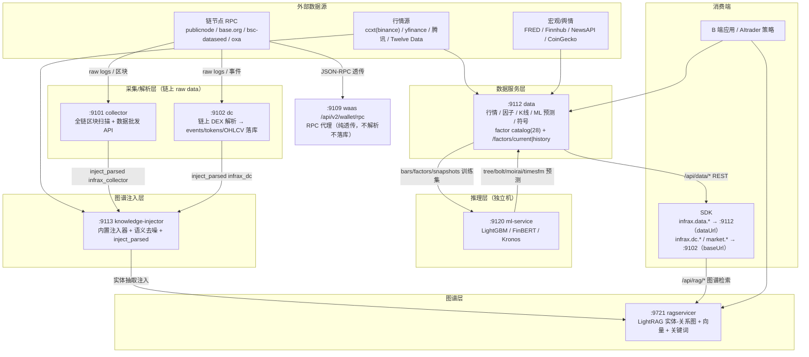

# InfraX 数据域架构图（DATA FLOW ARCHITECTURE）

> 更新：2026-08-07 | 生产环境 43.163.105.172（ml-service 独立机 43.156.25.197）
> 端口与职责为生产实测；本图仅覆盖**数据域**（区块链栈 waas/mpc/payment/vault/session-key 不在此列，仅画 RPC 代理旁路用于对比）。

## 1. 整体数据流向

## 2. 端口与职责一览

| 端口 | 服务 | 语言 | 职责 | 对外形态 |
|---|---|---|---|---|
| :9101 | collector | node | 全链区块扫描 + 数据批发 API（链上原始数据采集） | 内部（injector 消费） |
| :9102 | dc | node | 链上 DEX 数据：tokens/OHLCV/行情/交易/排行榜（raw data 解析落库） | `/api/v2/data/*`（nginx 已配，公网受 Cloudflare 502 影响） |
| :9112 | data | python | 行情 / 因子 / K线 / ML 预测 / 符号；factor catalog(28) | `/api/data/*`、`/api/v1/*` |
| :9113 | knowledge-injector | python | 内置注入器（19 类）+ 语义去噪 + `inject_parsed` 拉取 dc/collector 数据注入图谱 | `/api/injector/*`（公网 404，内网） |
| :9721 | ragservicer | python | LightRAG 实体-关系图 + 向量 + 关键词三路检索 | `/api/rag/*` |
| :9120 | ml-service | python | LightGBM / FinBERT / Kronos 三模型推理（**独立机** 43.156.25.197） | 内部（data 拉取） |
| :9109 | waas | node | RPC 代理（`/api/v2/wallet/rpc` 透传到链节点，不解析不落库）——**对比项** | `/api/v2/wallet/*` |

## 3. 关键流向说明

1. **链上数据（raw data 解析）**：公共 RPC 节点 → collector/dc 拉取 raw logs/区块 → **解析成结构化数据落库**（`events`/`tokens`/`ohlcv` 表）→ dc 提供 `/api/v2/data/*` REST。**它不属于 RPC 服务**——RPC 只是数据源，waas 的 rpc 代理才是纯透传（转发不解析）。
   - **raw 导出能力**（2026-08-07）：`/api/v2/data/events` 增补 `topic_hash`/`amount_raw`/`event_data` 原始字段；`/api/v2/data/raw-receipt?chain=&tx_hash=` 实时调公共 RPC 导出**完整原始 receipt logs**（topics 全量 + data 字节），供高级租户自解析（需自己备 ABI），不落库即时取。
2. **图谱链路**：data/collector/dc 的数据 → knowledge-injector（含 MQ-8 语义去噪）→ 注入 ragservicer（LightRAG）→ 应用经 `/api/rag/*` 检索。
3. **ML 回流**：data 把 bars/factors 喂给 ml-service 训练/推理 → 预测结果（tree/bolt/moirai/timesfm）写回 data 的 `ml_predictions`，进入 factor catalog（`ml` 类别 10 个因子）。
4. **SDK 区分**：`infrax.data.*`（dataUrl → :9112）与 `infrax.dc.*`/`market.*`（baseUrl → :9102）是两个独立服务入口，见 [SDK_INTEGRATION.md](SDK_INTEGRATION.md)。
