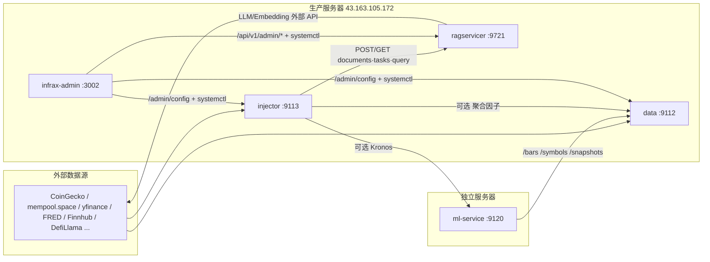

# InfraX 数据栈 端点与依赖一览（第三方监控 / 管理 Agent 接入）

> 用途：为**第三方监控系统**与**管理 Agent**提供各模块对外暴露的 HTTP 端点、鉴权方式与模块间依赖关系，可直接据此接入探活、数据面健康检查与可编程化管理。
>
> 配套任务：统一 tasklist §9.7（`docs/DEPLOYMENT_DATA_STACK.md`）——端点能力审查。本文档随代码路由变更同步维护。

## 1. 服务清单与部署拓扑

| 服务 | 端口 | 框架 | 生产状态 | systemd 单元 | 日志 |
|------|:---:|------|------|------|------|
| `infrax-data` | 9112 | FastAPI | ✅ 运行中（43.163.105.172） | `projects/data/infrax-data.service` | `projects/data/service.log` |
| `infrax-knowledge-injector` | 9113 | Flask（`--api`） | ✅ 运行中 | `projects/knowledge-injector/infrax-knowledge-injector.service` | `projects/knowledge-injector/service.log` |
| `infrax-ragservicer` | 9721 | Flask（LightRAG） | ✅ 运行中 | `projects/ragservicer/infrax-ragservicer.service` | `projects/ragservicer/service.log` / `journalctl -u infrax-ragservicer` |
| `infrax-ml-service` | 9120 | FastAPI | ✅ 运行中（43.156.25.197；master 7350d47，含统一鉴权 app_auth） | `infrax-ml-service.service` | `journalctl -u infrax-ml-service` |
| `infrax-admin`（可选） | 3002 | Node/React | 视部署 | `projects/admin` | `journalctl -u infrax-admin` |

## 2. 统一鉴权契约（app_auth）

所有服务业务端点复用同一契约（`projects/shared/app_auth.py`，各服务目录有回退副本）：

- **鉴权头三选一**：`Authorization: Bearer <key>` 或 `X-API-Key: <key>` 或 `X-Service-Key: <key>`（常量时间比较 `hmac.compare_digest`）
- **未授权响应统一**：`401 {"detail": "unauthorized"}`
- **豁免路径**：`/health`（ml-service 另豁免 `/docs` `/redoc` `/openapi.json`）
- **Key 回退链**：
  - data：`DATA_API_KEY` → `RAGSERVICER_API_KEY` → `DOC_API_KEY` → `LIGHTRAG_API_KEY`
  - injector：`INJECTOR_API_KEY` → `RAGSERVICER_API_KEY`
  - ml-service：`ML_API_KEY`
  - 未配置任何 key → 业务端点保持开放（向后兼容）
- **管理端点**：`/admin/config`（data/injector）与 ragservicer `/api/v1/admin/*` 需 `Bearer ADMIN_API_KEY`

ragservicer 租户鉴权为三层（`api/auth.py`）：bridge key（`RAGSERVICER_API_KEY`，命中即租户 `default`，可带 `X-Tenant-ID` 指定）→ DB 租户 key → admin key；三层均失败返回 401。

## 3. data-service :9112 端点

| Method | Path | 说明 | 鉴权 |
|:---:|------|------|:---:|
| GET | `/health` | 存活探活 `{code:0, data:{service, version}}` | 豁免 |
| GET | `/stats` | 库规模：kline_rows / snapshot_rows / symbols / 时间范围 | app_auth |
| GET | `/symbols?timeframe=&min_bars=` | 满足最少 bar 数的标的清单（ml-service 训练发现用） | app_auth |
| GET | `/symbols/search?keyword=&market=&limit=` | 符号模糊搜索（ccxt 4h 缓存 + 种子回退） | app_auth |
| GET | `/symbol/resolve?symbol=&market=` | 符号解析：单符号 → 标准交易对（DS-4，crypto 精确解析 binance spot 优先 + 非 crypto 种子直通；未知 404） | app_auth |
| GET | `/bars?symbol=&timeframe=&market_type=&start=&end=&limit=` | OHLCV + 预计算指标 + 外部因子（K 线主端点） | app_auth |
| GET | `/ticker?symbol=&market_type=&exchange_id=` | 实时报价（ccxt / yfinance / Tencent 多源） | app_auth |
| GET | `/factors/catalog` | 因子目录 | app_auth |
| GET | `/factors/current?symbols=&category=` | 最新因子值（external/heatmap/calendar/snapshot 分类） | app_auth |
| GET | `/factors/history?symbol=&timeframe=&ids=&start=&end=` | 逐 bar 因子时间序列 | app_auth |
| GET | `/ml/predictions?model=&symbol=&limit=` | P2 模型预测历史（bolt/moirai/timesfm） | app_auth |
| GET | `/snapshots?type=` | 复杂快照：crypto_prices/indices/tvl/volatility/us_indicators/earnings/onchain(btc_difficulty/btc_transfers)/market_overview 等 | app_auth |
| GET/PUT | `/admin/config` | 数据源 key 查看/热更新（写 .env + 重置 key 池，免重启） | `Bearer ADMIN_API_KEY` |

> **审查发现**：tasklist DS-4 `/symbol/resolve`、DS-5 `/policy/broker-market` 未在当前 `main.py` 中发现对应路由（契约文档有，代码未见），属待确认项。

## 4. knowledge-injector :9113 端点

| Method | Path | 说明 | 鉴权 |
|:---:|------|------|:---:|
| GET | `/health` | 存活探活，含 `lightrag_enabled` / `injector_count` | 豁免 |
| GET | `/status` | RAG 是否启用 + 实际注入器列表 | app_auth |
| GET | `/injectors` | 注入器清单 | app_auth |
| GET | `/stats` | 注入统计汇总 | app_auth |
| GET | `/stats/recent?limit=` | 最近注入记录（监控注入健康用） | app_auth |
| POST | `/inject/<source>` | 手动触发单源注入（19 项，见下） | app_auth |
| POST | `/inject/all` | 全量注入 | app_auth |
| POST | `/inject/parsed` | YAML 规则解析注入，`{source: infrax_dc\|infrax_collector, limit, dry_run}` | app_auth |
| POST | `/query` | 查询 RAG（`{query, top_k}`，默认 namespace=market） | app_auth |
| GET/PUT | `/admin/config` | 数据源 key（FRED/ETHERSCAN/FINNHUB/TUSHARE/NEWSAPI）查看/热更新 | `Bearer ADMIN_API_KEY` |

注入器（`inject_<source>`）：macro / sentiment / crypto_overview / volatility / news_sentiment / major_events / onchain / defi_tvl / macro_trend / fred_economics / earnings_index / evm / global_macro / indices / tech_analysis / tree_ml / consensus / p2_predictions / ml_predictions。

## 5. ragservicer :9721 端点（前缀 `/api/v1`）

| Method | Path | 说明 | 鉴权 |
|:---:|------|------|:---:|
| GET | `/api/v1/health` | 存活探活（实例数） | 豁免 |
| POST | `/api/v1/namespaces/{ns}/documents` | 注入文本 `{text, doc_id, async}`；默认异步 → 202+task_id，`?sync=1` 同步 → 201；重复 doc_id → 409 | tenant |
| GET | `/api/v1/namespaces/{ns}/documents?page=&limit=` | 文档列表（分页） | tenant |
| POST | `/api/v1/namespaces/{ns}/documents/batch` | 批量注入 | tenant |
| DELETE | `/api/v1/namespaces/{ns}/documents/{doc_id}` | 删除文档（默认异步） | tenant |
| GET | `/api/v1/namespaces/{ns}/tasks/{task_id}` | 写任务状态轮询（queued/success/failed） | tenant |
| POST | `/api/v1/namespaces/{ns}/query` | 检索上下文（不生成 LLM 答案），`{query, mode}`；mode 默认 mix | tenant |
| POST | `/api/v1/namespaces/{ns}/retrieve` | 检索 + 可配 `top_k`，供调用方自带 LLM | tenant |
| GET | `/api/v1/instances` | 实例清单（监控用） | admin |
| GET | `/api/v1/admin/tasks?limit=` | 写任务队列统计 + 最近任务（监控注入吞吐/积压） | admin |
| POST/GET | `/api/v1/tenants`、DELETE `/api/v1/tenants/{id}` | 租户 CRUD | admin |
| POST/GET | `/api/v1/tenants/{id}/keys` | 租户 API Key 生成/列表 | admin |
| POST | `/api/v1/keys/{key_id}/revoke` | 吊销 Key | admin |
| GET/PUT | `/api/v1/admin/config` | LLM/Embedding 配置查看/热更新（写 .env + reload + 重建实例，免重启） | admin |
| POST | `/api/v1/v1/bots/{bot_id}/documents[|/batch]`、`/query` | 旧版兼容路由（v3.0 移除；配置 ADMIN_API_KEY 后需 Bearer 门禁） | 兼容/可选门禁 |

**MCP Server**（`mcp_server/server.py`，STDIO 传输）：`tools/list` 暴露 5 个工具 —— `ragservicer_insert_document` / `ragservicer_query` / `ragservicer_delete_document` / `ragservicer_list_instances` / `ragservicer_retrieve`，供 AI Agent 直接调用 RAG 能力（tenant 由 `mcp_tenant_id` 配置）。

## 6. ml-service :9120 端点（独立服务器 43.156.25.197 已部署）

| Method | Path | 说明 | 鉴权 |
|:---:|------|------|:---:|
| GET | `/health` | 存活探活 | 豁免 |
| GET | `/ml/tree_predictions` | LightGBM 方向预测（训练+预测） | ML_API_KEY |
| POST | `/ml/sentiment` | FinBERT 新闻情绪聚合 `{articles: [...]}` | ML_API_KEY |
| GET | `/ml/volatility` | Kronos 波动率预测 | ML_API_KEY |
| GET | `/ml/consensus` | 跨模型信号共识 | ML_API_KEY |
| GET | `/ml/bolt` `/ml/moirai` `/ml/timesfm` | P2 时序模型概率预测 | ML_API_KEY |

所有 ML 端点 fail-silent：模型不可用返回 `data: null`。

> **部署状态**：已部署于独立服务器 43.156.25.197（:9120，`infrax-ml-service.service` 运行中）。2026-08-05 升级至 master `7350d47`（含统一鉴权 app_auth 1f4deea），生产 .env 已补 `ML_API_KEY`/`DATA_API_KEY`（主栈同一把 bridge key）；实测 §2 鉴权契约生效（/health 200 豁免、/ml/* 无 key 401、Bearer/X-API-Key/X-Service-Key 均 200）、/ml/consensus 六路信号出数。

## 7. 模块间依赖关系

| 依赖方 | 被依赖方 | 调用方式 | 配置项 |
|------|------|------|------|
| injector :9113 | ragservicer :9721 | POST documents（async + 轮询 tasks）、POST query；头 `X-API-Key` | `RAGSERVICER_URL`、`RAGSERVICER_API_KEY` |
| ml-service :9120 | data :9112 | GET `/bars` `/symbols` `/snapshots`；头 `X-API-Key` | `DATA_SERVICE_URL`、`DATA_API_KEY` |
| injector :9113 | data :9112（可选） | 聚合因子 | `DATA_SERVICE_URL` |
| injector :9113 | ml-service :9120（可选） | Kronos 波动率 | `ML_SERVICE_URL`、`ML_API_KEY` |
| ragservicer :9721 | LLM/Embedding 外部 API | 直连 | `LLM_BINDING_*` `LLM_MODEL` `EMBEDDING_*` |
| data / injector | 外部数据源 | HTTP | CoinGecko / mempool.space / blockchain.info / yfinance / akshare(新浪) / FRED / Finnhub / DefiLlama / Etherscan / NewsAPI / Tiingo 等 |
| admin :3002 | data/injector/ragservicer | `/admin/config` + `systemctl restart` | `DATA_BASE` `INJECTOR_BASE` `RAGSERVICER_BASE`、免密 sudo |

## 8. 第三方监控接入清单

监控 Agent 建议使用**服务专属只读 key**（或 bridge key）经 `X-Service-Key` 头访问：

| 监控维度 | 端点 | 关键字段 |
|------|------|------|
| 存活 | `GET http://<host>:9112/health` | `code==0` |
| 存活 | `GET http://<host>:9113/health` | `code==0` + `lightrag_enabled` |
| 存活 | `GET http://<host>:9721/api/v1/health` | `code==0` |
| 存活（ml） | `GET http://43.156.25.197:9120/health` | `code==0`（ML 端点另可用 `/ml/consensus` 探测） |
| 数据规模/新鲜度 | `GET :9112/stats` | `snapshot_rows`、`time_end` |
| 快照数据面 | `GET :9112/snapshots?type=onchain` 等 | 各 type 非空 + `ts` |
| 采集健康 | `GET :9112/factors/current` | `_ts` 新鲜度 |
| 注入健康 | `GET :9113/status` / `GET :9113/stats/recent` | injectors 数量、最近记录 |
| 注入吞吐/积压 | `GET :9721/api/v1/admin/tasks`（admin key） | `stats`、`tasks` 状态分布 |
| RAG 实例 | `GET :9721/api/v1/instances`（admin key） | `instances` 数 |

> **缺口（待 §9.7 7.4 补）**：当前无 Prometheus `/metrics` 或 OpenTelemetry 暴露，第三方监控需以 HTTP 端点轮询为准。

## 9. 管理 Agent 接入清单

| 管理动作 | 端点 | 说明 |
|------|------|------|
| 数据源 Key 配置 | `GET/PUT :9112/admin/config` | Bearer ADMIN_API_KEY；PUT 写 .env + 重置 key 池，**免重启** |
| 注入器 Key 配置 | `GET/PUT :9113/admin/config` | 同上 |
| LLM/Embedding 配置 | `GET/PUT :9721/api/v1/admin/config` | Bearer ADMIN_API_KEY；热更新免重启 |
| 租户管理 | `POST/GET /api/v1/tenants`、`DELETE /api/v1/tenants/{id}` | 多租户隔离 |
| 租户 Key 签发 | `POST/GET /api/v1/tenants/{id}/keys`、`POST /api/v1/keys/{id}/revoke` | 服务账号凭证管理 |
| 手动注入触发 | `POST :9113/inject/<source>` | 同步触发单源注入 |

## 10. 端点维护说明

路由注册位置（改代码时需同步本文档与 tasklist §9.7）：

- data：`projects/data/main.py`（FastAPI 装饰器集中注册）
- injector：`projects/knowledge-injector/api/routes.py`（`create_app()`）；注入器列表 `_ALL_INJECTORS`
- ragservicer：`projects/ragservicer/api/routes/__init__.py`（Blueprint 汇总）+ `documents.py` / `query.py` / `admin.py` / `legacy.py`
- ml-service：`projects/ml-service/main.py`
- 统一鉴权：`projects/shared/app_auth.py`（各服务 `app_auth.py` 为回退副本）
