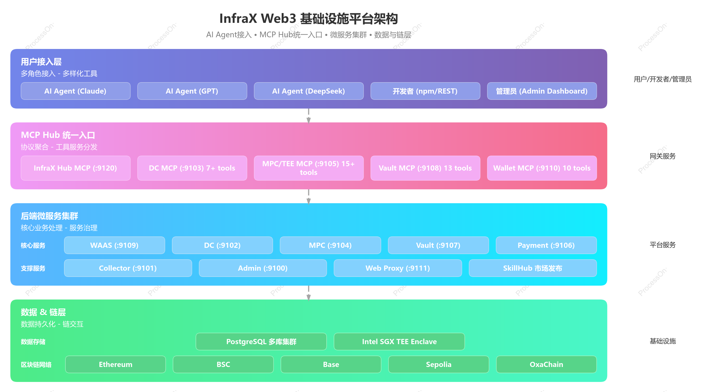
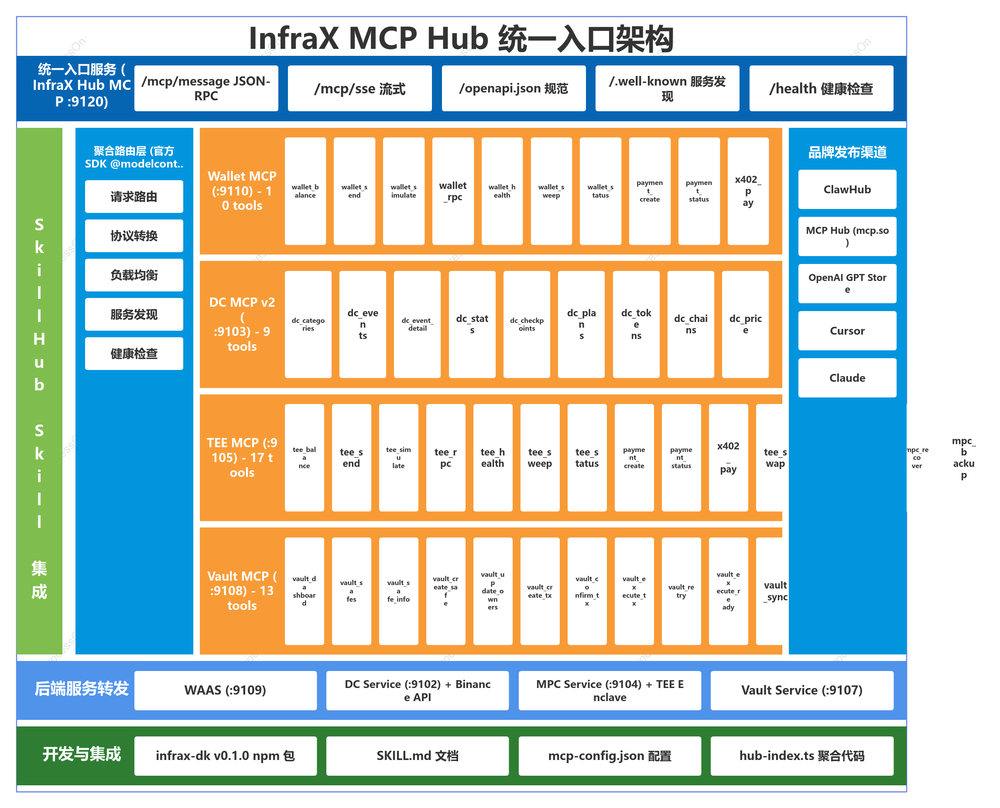
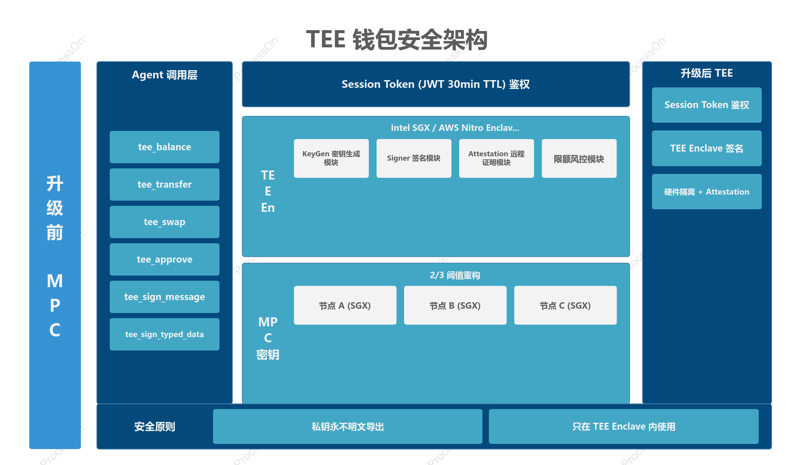
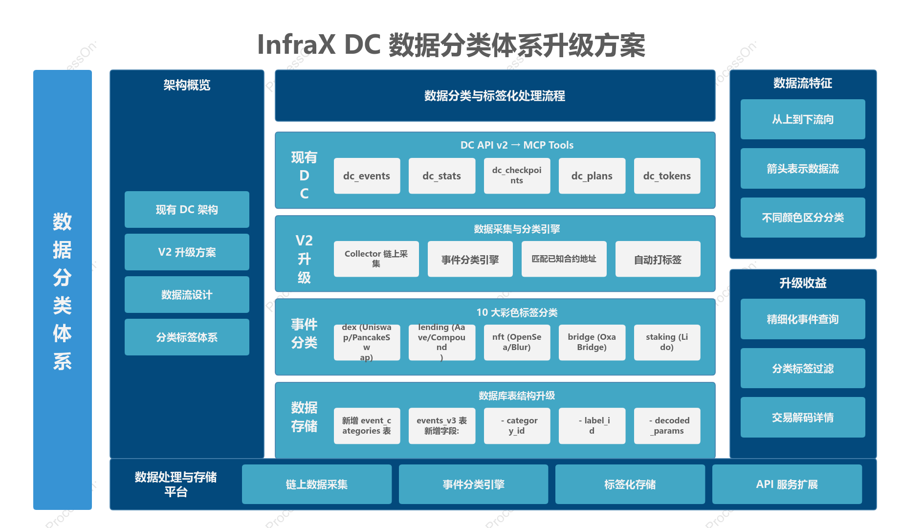

# InfraX 技术开发文档 — 总览

> 版本: v1.0 | 日期: 2026-07-30 | 作者: Wayne (team1)
>
> 配套 PRD: `prd/PRD.md` | 架构图: `prd/assets/`

---

## 1. 文档导航

本文档拆分为 5 个独立文件，按模块阅读：

| # | 文档 | 内容 | 关联架构图 |
|:---:|------|------|:---:|
| — | **TECHNICAL_DESIGN.md** (本文件) | 总览、开发环境、通用规范 | 图1 |
| 1 | **docs/01-mcp-hub.md** | MCP Hub 统一入口 | 图2 |
| 2 | **docs/02-dc-v2.md** | DC 数据分类升级 | 图4 |
| 3 | **docs/03-tee-wallet.md** | MPC → TEE 钱包重构 | 图3 |
| 4 | **docs/04-skill-publish.md** | SkillHub 品牌发布 | 图1 |

---

## 2. 开发环境

### 2.1 技术栈

| 层 | 技术 | 版本 |
|------|------|------|
| 运行时 | Node.js | ≥ v22 |
| 语言 | TypeScript | 5.x |
| MCP SDK | `@modelcontextprotocol/sdk` | latest |
| 包管理 | pnpm | — |
| 部署 | systemd + Docker | — |
| 链 RPC | Infura / Alchemy | — |
| TEE | Intel SGX SDK / AWS Nitro CLI | — |

### 2.2 本地启动

```bash
git clone https://github.com/sftgroup/infrax.git
cd infrax

# 安装依赖
cd projects/mcp-server && pnpm install && cd ../..
cd projects/sdk && pnpm install && cd ../..

# 启动 MCP 服务（开发模式）
cd projects/mcp-server
PORT=9120 node --loader ts-node/esm src/dc-index.ts &
PORT=9103 node --loader ts-node/esm src/index.ts &
PORT=9105 node --loader ts-node/esm src/mpc-index.ts &
PORT=9108 node --loader ts-node/esm src/vault-index.ts &
```

### 2.3 通用约束

1. **禁止硬编码** — 所有配置从环境变量读取（端口/URL/密钥）
2. **模块解耦** — 每个 MCP 独立进程，通过 HTTP 协议通信
3. **大文件拆分** — 单文件 > 500 行必须拆分
4. **标准命名** — tool 名用 `domain_action` 格式（如 `dc_events`、`tee_transfer`）
5. **错误处理** — MCP tool 返回结构化错误，不可 crash 进程
6. **类型安全** — 所有 MCP inputSchema 对应的 handler 参数用 Zod 校验

---

## 3. 架构图索引

### 图 1: InfraX 系统总览


### 图 2: MCP Hub 统一入口


### 图 3: TEE 钱包安全架构


### 图 4: DC 数据分类体系


---

## 4. 文件结构（开发后）

```
projects/
├── mcp-server/src/
│   ├── index.ts              ← Wallet MCP (已知，不改)
│   ├── dc-index.ts           ← DC MCP → 扩展为 v2
│   ├── mpc-index.ts          ← 重构为 tee-index.ts
│   ├── vault-index.ts        ← Vault MCP (已知，不改)
│   ├── hub-index.ts          ← 🆕 统一品牌入口
│   ├── lib/
│   │   ├── mcp-server.ts     ← 🆕 统一 MCP Server 工厂
│   │   ├── tool-registry.ts  ← 🆕 Tool 注册中心
│   │   └── sse-handler.ts    ← 🆕 SSE 事件处理器
│   └── openapi/
│       └── generator.ts      ← 🆕 OpenAPI 3.1 自动生成
├── dc/
│   ├── v3/                   ← 🆕 Data API v3
│   │   ├── categories.ts
│   │   ├── events.ts
│   │   └── balance.ts
│   └── migrations/
│       └── 003_categories.sql ← 🆕 分类表
├── mpc/
│   ├── services/
│   │   └── tee.ts            ← 🆕 TEE Enclave 客户端
│   └── server.ts             ← 改: 签名逻辑切 TEE
├── collector/
│   └── classifier.ts         ← 🆕 事件分类引擎
├── sdk/                      ← 已知，不改
└── infrax-skill/             ← 🆕 SkillHub 包
    ├── SKILL.md
    └── mcp-config.json
```

---

## 5. 开发顺序建议

| Phase | 内容 | 预估 | 产出 |
|:---:|------|:---:|------|
| 1 | 阅读 `docs/02-dc-v2.md`，实现 DC 扩展 | 1 周 | dc-index v2 + DC API v3 |
| 2 | 阅读 `docs/03-tee-wallet.md`，重构 MPC → TEE | 2 周 | tee-index.ts + TEE Service |
| 3 | 阅读 `docs/01-mcp-hub.md`，实现 Hub | 1 周 | hub-index.ts + OpenAPI |
| 4 | 阅读 `docs/04-skill-publish.md`，发布品牌 Skill | 0.5 周 | SKILL.md + 多市场 |
